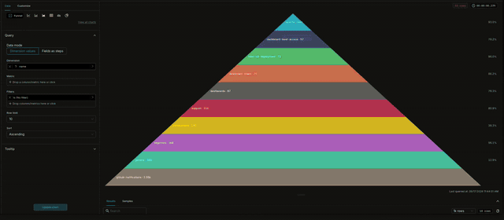

# 🪣 Funnel Chart Plugin — Apache Superset chart
---

### [🇷🇺 Русский](README.ru.md) | 🇬🇧 English

---

> **A custom Apache Superset plugin** that renders a Power BI–style funnel
> chart: sequential stages, conversion percentages, per-step colors,
> customizable tooltips and dashboard cross-filtering. No dataset
> preparation is required — the plugin groups and aggregates data itself.

---



---

## ✨ Features

- Dashboard chart (**not** a Native Filter)
- **Two data modes**:
  - *Dimension values* — pick one dimension and one metric; the plugin runs
    `GROUP BY` itself, every distinct value becomes a funnel step
  - *Fields as steps* — insert several columns; each column becomes a step,
    **the step order matches the order of the inserted fields**, and the
    metric is aggregated over the rows where the column is filled
- **Per-step metrics** (fields mode): every step gets its own metric —
  a dataset column with an aggregate (Sum, Count, **Count distinct**,
  Average, Min, Max), a saved dataset metric, or a **custom SQL
  expression**. Steps without one count the rows where the field is
  filled (`COUNT(*)`). This builds funnels over different measures
  directly, e.g. unique applications → unique clients → event counts
- **Conversion rates**: percent of the first step and percent of the
  previous step — shown on labels, in the conversion column and in tooltips.
  The "first step" is always the funnel base: in the dimension mode the
  value sort puts it at one of the shape ends, in the fields mode it is
  the **first field** in Step fields — arrange the fields from the base
  toward the apex
- Power BI–compatible **label content**: data value / % of first /
  % of previous / combinations
- **Two shapes**: *Rectangles* (separated centered bars, Power BI look) and
  *Funnel* (continuous trapezoids)
- **Two extra shapes**: *Smooth funnel* (curved transitions, monotone cubic
  spline — no sharp jumps) and *Pyramid* (triangle with equal-height slices,
  the smallest value at the apex)
- **Sort control applies to every shape**: ASC keeps the apex at the top,
  DESC flips the chart (wide base on top). In the dimension mode it sorts
  by the metric value with a name tie-break in the same direction (DESC is
  the exact reverse of ASC); in the fields mode it only flips the display —
  the field order defines the steps
- **Bar height, %**: relative bar height — 50% is the automatic fit,
  lower makes bars thinner, higher denser; the gap physically separates
  bars and the chart always fits the screen
- **Colors**: gradient over a sequential color scheme or a custom color
  per step
- **Tooltips**: pick extra columns and/or provide a Handlebars template
- **Cross-filtering**: click a step to filter the dashboard — `IN` on the
  dimension value (dimension mode) or `IS NOT NULL` on the step column
  (fields mode); multi-select with toggle-off
- Sorting ASC / DESC by value (ties by name) in the dimension mode
- Number and percent D3 formats, gap slider, labels toggle

---

## 📋 Requirements

| Component | Version |
|-----------|---------|
| Apache Superset | 6.1.0 |
| Python | 3.10+ |
| Node.js | 20+ (image build: 22) |
| npm | 10+ |
| React (peer) | ^17.0.2 |
| npm package | `@superset-ui/plugin-chart-funnel` |
| Plugin key | `chart_funnel` |
| Dependencies | `handlebars` (tooltip templates) |

---

## 🚀 Installation

### Step 1. Clone the Superset repository (target version)


```bash
git clone https://github.com/apache/superset.git -b 6.1.0;
```

### Step 2. Clone the plugin repository

```bash
git clone https://github.com/Kami-sama322/superset-plugin-chart-funnel.git;
```

### Step 3. Run the auto-installation script

```bash
chmod +x superset-plugin-chart-funnel/install.sh;
./superset-plugin-chart-funnel/install.sh ./superset;
```

> `./superset` — root of the Superset repo from Step 1. The script installs
> the plugin as a **standalone npm package** into
> `superset-frontend/plugins/plugin-chart-funnel/` and registers it at
> Superset's documented extension points. npm workspaces (`plugins/*`)
> link the package on the next `npm install`.

#### What the script does:

| Action | File |
|--------|------|
| 0. Installs the plugin package | `superset-frontend/plugins/plugin-chart-funnel/` |
| 1. Registers the plugin in the extension hook | `superset-frontend/src/setup/setupPluginsExtra.ts` (`key: chart_funnel`) |
| 2. Adds the `file:` workspace dependency | `superset-frontend/package.json` |

> The `@superset-ui/plugin-chart-*` path alias already covers this package —
> no extra `tsconfig.json` entry. `FILTER_SUPPORTED_TYPES` is **not**
> changed (chart, not Native Filter).

### Step 4. Build and run

```bash
cd superset/superset-frontend
npm install
npm run dev-server
```

Production image builds work the same way — see the sibling
`superset-prod-dockerfile/` repository.

---

## 🧭 Usage

1. **Charts → + Chart → Funnel**, pick a dataset.
2. Choose the **Data mode**:
   - *Dimension values*: select a **Dimension** (e.g. sales stage) and a
     **Metric** (e.g. Opportunity count). Steps are ordered by the metric
     (ascending by default, ASC / DESC sort control).
    - *Fields as steps*: drag columns into **Step fields** — the first
      column is the funnel base (100%), each next one follows it in the
      process order. In **Step metrics** every new field starts preselected
      on **its own column + Count** (numerically the same as `COUNT(*)`):
      switch the **aggregate** next to it (e.g. `Count distinct` on an ID
      column for unique counts, `Sum` on a 0/1 flag for event counts),
      pick a **saved metric**, or choose **SQL expression** and type any
      SQL — it is applied on blur / Enter, and clearing it removes the
      metric. Steps without their own metric count the rows where the
      field is filled (`COUNT(*)`; the select placeholder shows the exact
      fallback). The **Sort** control only flips the display:
      ASC puts the apex on top, DESC keeps the base on top.

   Example — dataset `app_id, client_id, event_1 (0/1), event_2 (0/1)`:
   fields `app_id, client_id, event_1, event_2` with step metrics
   `COUNT_DISTINCT(app_id)`, `COUNT_DISTINCT(client_id)`, `SUM(event_1)`,
   `SUM(event_2)` and the shared Metric left empty render
   unique applications → unique clients → event 1 → event 2 in one chart.
3. Tune colors, shape, labels and the tooltip in the **Display** and
   **Tooltip** sections.
4. To make clicks filter the dashboard, enable **cross-filtering** on the
   chart and the dashboard.

### Tooltip template variables

Built-ins: `{{label}}`, `{{value}}`, `{{value_formatted}}`,
`{{percent_first}}`, `{{percent_first_formatted}}`,
`{{percent_previous}}`, `{{percent_previous_formatted}}`.
Columns selected in **Tooltip contents** are available by their names
(dimension mode).

> **CSP requirement**: Handlebars compiles templates at runtime, so the
> Superset CSP must allow `'unsafe-eval'` in `script-src` (see
> `TALISMAN_CONFIG`). Without it every template render throws and the
> tooltip silently falls back to the default rows.

---

## ⚙️ Configuration reference

### Query

| Control | Modes | Description |
|---------|-------|-------------|
| Data mode | both | `dimension` (group by) or `fields` (columns as steps) |
| Dimension | dimension | Column with step values |
| Step fields | fields | Columns, one per step; order matters |
| Step metrics | fields | Metric per step field: column + aggregate, saved metric, or custom SQL; new fields start preselected on their own column + Count; keyed by field name, survives reordering |
| Metric | dimension | Shared step metric; empty → `COUNT(*)` |
| Row limit | dimension | Default 50 steps max |

### Display

| Control | Description |
|---------|-------------|
| Shape | Rectangles (Power BI) / Funnel / Smooth funnel / Pyramid |
| Color mode | Gradient / Custom per-step colors |
| Gradient color scheme | Sequential scheme (gradient mode) |
| Step colors | Ready-made per-step picker list (populated from the query result / step fields); unset steps fall back to the categorical scheme |
| Show labels + Label content | Label visibility and what the bar label shows: Data value / % of first / % of previous / combos. A label that does not fit a narrow step is shifted out to the left of the step, right-aligned with its left edge |
| Conversion column | Checkbox + content select: Data value / % of previous / % of first |
| Bar height, % | 100% = bars fill the screen (default), lower = thinner; the gap is a physical separation and stays intact |
| Number format / Percent format | Standard Superset D3 format controls |

---

## ✅ Verification

```bash
# Local production-style image (plugins are COPY-ed from sibling dirs)
cd superset-prod-dockerfile
docker compose -f docker-compose.dev.yml build
docker compose -f docker-compose.dev.yml up -d
# http://localhost:8088 — Charts → + Chart → Funnel
```

Unit tests live in `src/*.test.ts` (Jest). After running `install.sh`
they can be executed from the Superset frontend tree:

```bash
cd superset/superset-frontend
npx jest plugins/plugin-chart-funnel
```

---

## 📄 License

Apache License 2.0 — see [LICENSE](LICENSE).
